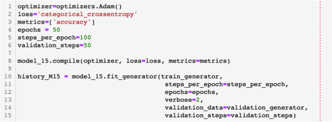

<font size="7"><b>Pneumonia Detection from X-ray images using Deep Learning Neural Network</b></font>


# Summary

<u>Description/objective</u>: This project consists on using Deep Learning Neural Network to classify a set of structured X-rays images of pediatric patients  to identify whether or not they have pneumonia. The Neural Network chosen was the Convolutional Neural Network (CNN/ConvNet) as it is one of the preferred for image processing. 


# Pneumonia background

This project is not intended as a study of Pneumonia itself, but to detecting it from X-rays images by using Deep Learning Neural Networks. Therefore only a short explanation of what the disease is and why it is important in today's world will follow. 

<b>So what is Pneumonia?</b>

Pneumonia is an infection of the lungs that may be caused by bacteria, viruses, or fungi. The infection causes the lung's air sac, or alveoli, to become inflamed and fill up with fluid or pus. This progression then limits a person's ability to take in oxygen. If there is a continuous deprivation of oxygen, many of the body's organs can get damaged, causing kidney failure, heart failure, and other life threatening conditions.

The symptoms of pneumonia can range from mild to severe, and include cough, fever, chills, and trouble breathing.

<a href="https://www.lung.org/lung-health-diseases/lung-disease-lookup/pneumonia/learn-about-pneumonia">Source</a>

<b>Is there any relationship between Pneumonia and Covid-19?</b>

According to the Center for Disease Control and Prevention (CDC), Covid-19 is a respiratory illness where a person can experience a dry cough, fever, muscle aches, and fatigue.

This virus can progress through the respiratory tract and into a person’s lungs causing pneumonia. People with severe cases of pneumonia may have lungs that are so inflamed that they cannot take in enough oxygen or expel enough carbon dioxide.

According to the World Health Organization (WHO), the most common diagnosis for severe COVID-19 is severe pneumonia. For people who do develop symptoms in the lungs, COVID-19 may be life threatening, therefore, the detection of Pneumonia through X-ray has increased its importance due to the worldwide spread of Covid-19.

<a href="https://www.medicalnewstoday.com/articles/pneumonia-and-covid-19#relationship">Source</a>


# Convolutional Neural Network (CNN) background

A Convolutional Neural Network (CNN/ConvNet) is a Deep Learning algorithm which can take in an input image, assign importance (learnable weights and biases) to various aspects/objects in the image and be able to differentiate one from the other. The pre-processing required in a CNN is much lower as compared to other classification algorithms. While in primitive methods filters are hand-engineered, with enough training, CNN have the ability to learn these filters/characteristics.

The architecture of a CNN is analogous to that of the connectivity pattern of Neurons in the Human Brain and was inspired by the organization of the Visual Cortex. Individual neurons respond to stimuli only in a restricted region of the visual field known as the Receptive Field. A collection of such fields overlap to cover the entire visual area.

A CNN is able to successfully capture the Spatial and Temporal dependencies in an image through the application of relevant filters. The architecture performs a better fitting to the image dataset due to the reduction in the number of parameters involved and reusability of weights. In other words, the network can be trained to understand the sophistication of the image better.

For a very comprehensive guide of Convolutional Neural Network, refer to this <a href="https://towardsdatascience.com/a-comprehensive-guide-to-convolutional-neural-networks-the-eli5-way-3bd2b1164a53">link</a>

So with that short introduction to what CNNs are, and why it was the choice for this project, it's time to go into the data gathering and how the X-rays that came as a nested folder structured was loaded:


# Data Gathering

The dataset was downloaded from <a href="https://www.kaggle.com/paultimothymooney/chest-xray-pneumonia">Kaggle</a> and it consists of 5856 X-ray images contained in a hierarchical file structure which has been already split into three subsets folders (test, train, and val), each of which containing sub-folders (NORMAL and PNEUMONIA) where the X-ray images have been already labeled (Figure_2)


Figure_2. X-ray hierarchical File Structure with images already split into three main folders and two sub-folders separating the labeling.


The split already done into train, test, and val datasets, was done as it is the best way to obtain unbiased estimate of the model performance, therefore we kept it and only created strings to each folder to access the data by using the function: os.path.join(), for example: train_dir = os.path.join(data_dir, "train/"), where data_dir was previously defined: data_dir = "../chest_xray/"

Furthermore, the train_dir (defined above), was tied to it's internal folder structure containing NORMAL and PNEUMONIA, as follows: 

os.listdir(train_dir)

train_normal = train_dir + 'NORMAL/'

train_pneumo = train_dir + 'PNEUMONIA/'

With the access already achieved to each subset folder, the next step was to identify how many images we had access to per subset. From the dataset description in Kaggle we know that there are 5856 X-ray images, but there was no information regarding the number of images per subset. To solve this, a function was created to access each subset folder which would output information such as the example below:

<u>Train set X-ray content:</u> 

Number of X-rays classified as NORMAL: 1341

Number of X-rays classified as PNEUMONIA: 3875

Total number of Train X-rays: 5216

At this point we have basically managed to established a connection to all the nested/hierarchical file structure. The next step is to try to visualize some of the X-rays which should be randomly selected. This was managed with another function that randomly selected images from the subset folders as Figure_3 shows:


Figure_3. 10 randomly selected X-rays with the upper 5 being labeled as PNEUMONIA and the lower ones as NORMAL. 


# Data Visualization

Based on the output of the function that counted the number of X-rays corresponding to each category, we know that the data might be imbalanced, so this will be to double checked by using a visual tool, which is the preferred method for many people.

First, I would like to clarify that I modified the validation subset (val_set) beforehand. The reason why I did this is because it only had 16 samples (8 NORMAL and 8 PNEUMONIA), and that seemed like a low number to validate the training results. The solution was to take 100 images from the test subset and not from the train subset even when it has a considerable larger sample number. I tried to keep the train set as large as possible as this is a Deep Learning Neural Network exercise, and therefore needs to have the largest training subset possible. So, form the test subset I randomly selected 50 X-rays from the NORMAL and 50 from the PNEUMONIA subset and transferred them to their respective folders inside the validation subset folders. 

Now that that point has been clarified, lets look at the data distribution on Figure_4:


Figure_4. Bar-plots showing the X-ray image distribution per subset

The data is clearly unbalanced, however, it will be left as it is to try to give the highest weight possible to the training set, since it is well known that Deep Learning needs big datasets. In fact, the train subset will be augmented so that the number of images increases even more and gives a better chance of stability to the model 

After the small manipulations done to the datasets, the split percentage is the following:

* Train sub-set: 89.07% 

* Test sub-set: 8.95% 

* Val sub-set: 1.98%

# Image Preprocessing

Now I have granted access to the entire hierarchical file structure, I'll go into the only two data pre-processing steps that I did, with one being augmentation, which I have included in this section as it was done prior to any model.  

<b>Image Rescaling:</b> Since neural networks receive inputs of the same size, all images need to be resized to a fixed size before inputting them to the CNN. The larger the fixed size, the less shrinking required. Less shrinking means less deformation of features and patterns inside the image and therefore higher the chances that the selected algorithm will perform well.

All the images have been rescaled to 256 colors (0 - 255). There is always a second option which is to re-scale even further to [0,1] and could accelerate the model, but we didn't go that route

<b>Data Augmentation:</b> It is well known that the performance of Deep Learning Neural Networks often improves with the amount of data available, therefore increasing the number of data samples could result in a more skillful model. This can be achieved by doing "Data Augmentation", which is a technique to artificially create new training data from existing training data. This is done by applying domain-specific techniques to examples from the training data that create new and different training examples by simply shifting, flipping, rotating, modifying brightness, and zooming the training examples (<a href="https://machinelearningmastery.com/how-to-configure-image-data-augmentation-when-training-deep-learning-neural-networks/">source</a>). 

For our train subset, the "Data Augmentation" parameters that were used were the following 3:
 
* shear_range=0.2

* zoom_range=0.2

* horizontal_flip=True

# Model Architecture

A total of 15 different model architectures were tested with many modifications going from the simplest 3 layer model to considerably more complicated with 5 twin Conv2D layers and a series of other layers to try to account for over-fitting. All of these models are available on an additional notebook available on this repository (Model_Library) where all have been tested with different number of epochs, some with just 5, and others up to 50 and more. Each one of these models has visualizations plots to evaluate them and each has also been tested with the test subset to have glimpse of their respective accuracies.

Before we go into the details of the architecture that was kept for our final models, I'll go through some theory explaining particular types of layers, optimizers, losses, and activation functions that I used in order to make it easier to understand the different additions/subtractions to every model.

## Layers

<b>Pooling:</b> This is one of the building blocks of CNN. It's function is to progressively reduce the spatial size of the representation to reduce the amount of parameters and computation in the network. Pooling layers operates on each feature map independently.

The pooling layers that have been added to all the models created during this project are MaxPooling. This is a pooling technique that selects the maximum element from the region of the feature map covered by the filter. Thus, the output after MaxPooling layer would be a feature map containing the most prominent features of the previous feature map. This was applied after each Conv2D layer added to the model. 


Figure_5. Representation of how Max Pooling and Average Pooling work

<b>Flattening:</b> The last stage in CNN is flattening where the spatial dimensions of the input are collapsed into the channel dimension (Figure_6).


Figure_6. Flattening Layer representation with the spatial dimension illustrated on the left, and the collapse dimension on the right

## Optimizers and Loss

<b>Adam Optimizer:</b> This is one of the most, if not the most popular optimizer today. Adam is a replacement optimization algorithm for stochastic gradient descent for training deep learning models. Adam combines thee best propertiess of the AdaGrad and RMSProp algorithmss to providee an optimization algorithm that can handle sparse gradients on noisy problems. 

<b>Categorical Crossentropy:</b> This is also called the Softmax Loss. It is a Softmax activation plus a Crosss-Entropy loss. If we use this loss, we will train a CNN to output a probability over the C Classes for each image. It is normally used for multi classification, however, it was used on this model with 2 categories to replace the Sigmoid, which was not working properly as it stagnated at 50% validation accuracy. 

## Activation Function

<b>Softmax Activation</b>: Softmax converts a real vector to a vector of categorical probabilities. The elements of the output vector are in range (0,1) and sum to 1. Each vector is handled independently. The axis argument sets which axis of the input the functions is applied along. 

Softmax is often used as the activation for the last layer of a classification network because the result could be interpreted as a probability distribution. 

Under normal circumstances, Sigmoid should have been a good option for this binary problem, but for an unknown reason, it wasn't performing well resulting with a "Validation Accuracy" stagnated at 50%. With this said, using "Softmax" with 2 categories is the equivalent of a "Sigmoid".

Softmax activation is generally used instead of Sigmoid with the cross-entropy loss because Softmax distributes the probability throughout each output node.

## Final Models

As mentioned above, fifteen different models were tested, starting from a simple 3 layers ones, to more elaborated 5 layers with different hyper-parameters to try to account for over-fitting. The entire list of models is available with their respective descriptions, visualizations plots for loss and accuracy evaluations on a separate notebook named Model_Library.

Out of these models, two were selected as the best performers, Model_5, which is a rather simple three Convolution Block model, and Model_15, which is a five Convolution Block model with twin (double) Conv2D per block and Dropout of 0.2, so a more elaborated architecture which was expected to take longer to be trained. 

All of the models were initially trained with 5, 10 and 15 epochs, and when the validation accuracy ended up being greater than 70%, the epochs were increased to 30 and 50 depending on the model architecture complexity. Furthermore, an attempt was done to run both models with 100 epochs but neither was successful and ended with the laptop crashing. Once I managed to have results with 100 epochs I will update this repository with those results regardless of their nature (positive or negative).

Figure_7 illustrates the simple architecture of Model_5 with no tuning tools such as Batch Normalization, Regularization, or Dropouts. When these were tested the validation accuracy drop and stayed stagnant to 50%, therefore they were eliminated and it was decided to keep that overfitting seen on the last epochs from the train accuracy.

Figure_8 shows the compile and Fitting parameters used for Model_5. As you can see, nothing special nor different than the norm with the exception of the activation used which was "Softmax". As previously explained, Sigmoid was pushing the validation accuracy to 50%, therefore the workaround was to convert this binary problem into a classification with two categories, which basically makes the Softmax reesponse, the same than the Sigmod.  


                    Figure_7. Model_5 Layer Architecture


                    Figure_8. Model_5 "Compile" and "Fitting" parameters used

Figure_9 illustrates the more complex architecture of Model_15 where two (twin) convolution layers have been added per convolution block plus the Dropout in the Fully Connected Layers to reduce the overfitting. Initially the thinking was that this model by being more complex was more complete and had the potential to perform better and result with a better accuracy. so let's continue and see if that's true, or if the assumption was wrong a complex architecture might not always beat a simple one.

As for Model_5, no tunning tools have been used for Model_15, except for the Dropout during the fully connected layers. The Compile and Fitting parameters have been added (Figure_10), and once again nothing out of the norm except for the Softmax activator.


                    Figure_9. Model_15 Layer Architecture



                    Figure_10. Model_15 "Compile" and "Fitting" parameters used


# Models Performance Visualization

Now the best or easier way that I found to evaluate the models is via visualization of their accuracy and loss graphically. Figure_11 and 12 illustrate these values for Model_5 (Figure_11) and Model_15 (Figure_12) respectively.


                    Figure_11.Model_5 Loss and Accuracy for both the Train and Validation subset


                    Figure_12. Model_15 Loss and Accuracy for both the Train and Validation subset

From the Validation accuracy and loss it can be interpreted that the models have not converged yet with the 50 epochs that they were fitted to, but in both cases the curves show indications that they will converge with larger number of epochs. An attempt was already done to run 100 epochs but unfortunately the hardware used was not strong enough and ended up crashing. Due to timing it might not be possible to have this new results before the project is submitted, if that is the case, then this repository will be updated later on with the models ran on the number of epochs necessary for a convergence which, once again, should not be too far as the trend of the plots suggests. 

Still the models accuracies when overfitted, weren't bad with the test subset used. See the results below:

<b>Model_5:</b>

* Test accuracy: 91.22%

* Test loss: 0.39

* Validation accuracy: 93.10%

* Train accuracy: 97.22%

<b>Model_15:</b>

* Test accuracy: 90.84%

* Test loss: 0.30

* Validation accuracy: 94.83%

* Train accuracy: 96.69%

So far it seems that the simple Model_5 has a better accuracy than the Model_15 and the simpler architecture is winning. Still, by looking at the train accuracy it should be clear that both models are overfitted. 

To go one step further evaluating this model, it is important to clarify that as a performance measure, accuracy is inappropriate for imbalanced classification problems such as this one. The reason being that the high number of samples form the train subset(majority class), will overwhelm the number of examples in the minority class. Meaning that even unskillful models can achieve accuracy scores of 90%, or even 99%, depending on how severe the class imbalance happens to be. To read more about this subject go to this <a href="https://machinelearningmastery.com/precision-recall-and-f-measure-for-imbalanced-classification/">link</a>

Probably one of the best alternatives to using classification accuracy is to use precision, recall and F-1 metrics. As a quick reminder, lets revisit what these metric concepts are and then lets calculate them:

<b>Precision:</b> quantifies the number of positive class predictions that actually belong to the positive class = TP/(TP + FP)

<b>Recall:</b> quantifies the number of positive class predictions made out of all positive examples in the dataset = TP/(TP + FN)

<b>F1-Score:</b> provides a single score that balances both the concerns of precision and recall in one number = (TP + TN)/Total

Where, 

TP = True Positive
TN = True Negative 
FP = False Positive
FN = False Negative

Total = TP + FP + TN + TP

These three metrics can be easily calculated by using the <a href="https://scikit-learn.org/stable/">skicit-learn</a> library functions. The results were the following:

Model_15:

* Precision score: 72.39%

* Recall score: 97.94%

* F1 score: 83.15%

Model_15:

* Precision score: 87.05%

* Recall score: 85.0%

* F1 score: 86.01%

Now before we make any quick conclusions, lets look as well at both Confusion Matrices and better understand these metrics keeping in mind that because this is a medical case, precision is not as important as Recall. The Recall will be what separates our models. This is easy to explain with an real case scenario. You will definitely prefer that the doctor tells you that you have pneumonia when in reality you don't have it, than the doctor telling you that you are healthy and don't have pneumonia, but it turns out that you do have pneumonia, and the doctor just made a mistake. Normally doctors attempt to have a higher Recall as they rather treat more patients, even when some might not be sick. This happens particularly with strong illnesses or a pandemic as the one wee are living today with Covid-19. Preciison is an important metric but for different types of problems. 

As a reminder, the confusion matrix is simply a table often used to describe the performance of classification models (or classifiers) on a set of data for which the true values are known. These are useful to fast identify true positives, true negatives, false positives, and false negatives, or simply compare prediction numbers against true values.

With the previous explanations, it is clear now that for this medical problem, our prefere model would definitely be Model_5 over Model_15 which had higher Train and Validation accuracy values. 


            Figure_13. Confusion Matrix for Model_5 performance using the test subset. 


            Figure_14. Confusion Matrix for Model_15 performance using the test subset. 

Now, if you look at both of the matrices and concentrate on the 7 representing the FN  and the 333 representing the TP from Model_5 (Figure_13), and on the 51 and 289 representing the FN and TP respectively, then I'm sure that you will agree that it is bettre to have 7 FN instead of 51, meaning that you will only miss 7 patients having pneumonia and you told them that they are healthy instead of 51. 

These simple tests showed that a model with a complex architecture doesn't translate as better performance or accuracy. On the contrary, it took longer to run and the Recall is considerably lower than that of Model_5, which is my preferred one.  

# Recommendations

The following recommendations are based on my short experience with Deep Learning Neural Network, and they represent the challenges I faced during this project.

* Check your data’s distribution so that you can properly interpret your model after training it. An unbalanced dataset will not be properly evaluated with just accuracy but with other metrics such as precision and recall. Confusion Matrices are very useful 


* Don’t over complicate the model’s architecture as it won’t necessarily translate as better. Start simple and add layers as you progress


* Don’t limit yourself to just one model. Try different options so that you can compare results and reduce uncertainty


* Further investigate why when using the Sigmoid Activation with Python 3.6 on recent MacBook Pros causes problems to the validation accuracy, and when changing the activation to "Softmax" with two categories, meaning, making it equivalent to the sigmoid, then the Validation accuracy starts working properly. This has been reported by several users online with the workaround I used, but I have not seen any official solution (maybe it was me that didn't find it and it already exists, or maybe not?) 

# Way Forward

* Using the dataset available from the <a href="https://data.mendeley.com/datasets/rscbjbr9sj/3">Mendeley</a> site from June 2018 as there seems to be a larger number of images and therefore probably more adequate for Deep Learning. This will force the user to do it's own split and maybe end up with a more balanced distribution, something like 80, 10, 10, instead of the one available on Kaggle, where there are only 16 images out of 5856 on the entire data assigned to the validation subset. This represents around 0.2% so maybe it is too small. 


* Try running both Models (Model_5 and Model_15) with 100 epochs or more if necessary to determine if there is convergence as with 50 it seems as it will happen very soon. These tests were already attempted with no success due to hardware failure. 


* Following the recommendations above, I will redo this exercise doing my own split using the 2018 Mendeley dataset and compare results. 


* Further explore other hyper-parameters that could help with further tuning and probably reducing the overfit encountered with the train subset. 

# Notebooks Description

* Final_Model: Main notebook where all the links to the nested file structure, X-ray image visualization and image re-scaling and augmentation was done. Furthermore what is called the Final Model, selected as the onee with the best performance is also describe, ran and evaluated here. 


* Model_Library: the 15 different models are described on this notebook They are all already ran and evaluated through visualization and accuracy calculations. 


* Functions: Notebook with all the functions created. Keep in mind that these functions are not used all in a single notebook but separately, depending on what the objective of the notebook was


```python

```
