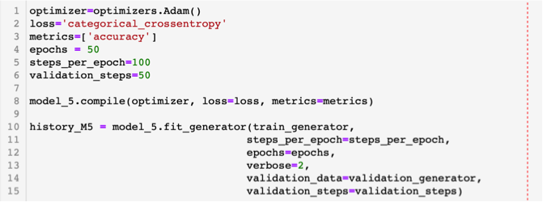

<b>Pneumonia Detection from X-ray images using Deep Learning Neural Network</b>

# Summary

<u>Description/objective</u>: This project consists on using Deep Learning Neural Network to classify a set of structured X-rays images of pediatric patients  to identify whether or not they have pneumonia. The Neural Network chosen was the Convolutional Neural Network (CNN/ConvNet) as it is one of the preferred for image processing. 

# Pneumonia background

This project is not intended as a study of Pneumonia itself, but to detecting it from X-rays images by using Deep Learning Neural Networks. Therefore only a short explanation of what the disease is and why it is important in today's world will follow. 

<b>So what is Pneumonia?</b>

Pneumonia is an infection of the lungs that may be caused by bacteria, viruses, or fungi. The infection causes the lung's air sac, or alveoli, to become inflamed and fill up with fluid or pus. This progression then limits a person's ability to take in oxygen. If there is a continuous deprivation of oxygen, many of the body's organs can get damaged, causing kidney failure, heart failure, and other life threatening conditions.

The symptoms of pneumonia can range from mild to severe, and include cough, fever, chills, and trouble breathing.

<a href="https://www.lung.org/lung-health-diseases/lung-disease-lookup/pneumonia/learn-about-pneumonia">Source</a>

<b>Is there any relationship between Pneumonia and Covid-19?</b>

According to the Center for Disease Control and Prevention (CDC), Covid-19 is a respiratory illness where a person can experience a dry cough, fever, muscle aches, and fatigue.

This virus can progress through the respiratory tract and into a person’s lungs causing pneumonia. People with severe cases of pneumonia may have lungs that are so inflamed that they cannot take in enough oxygen or expel enough carbon dioxide.

According to the World Health Organization (WHO), the most common diagnosis for severe COVID-19 is severe pneumonia. For people who do develop symptoms in the lungs, COVID-19 may be life threatening, therefore, the detection of Pneumonia through X-ray has increased its importance due to the worldwide spread of Covid-19.

<a href="https://www.medicalnewstoday.com/articles/pneumonia-and-covid-19#relationship">Source</a>

# Convolutional Neural Network (CNN) background

A Convolutional Neural Network (CNN/ConvNet) is a Deep Learning algorithm which can take in an input image, assign importance (learnable weights and biases) to various aspects/objects in the image and be able to differentiate one from the other. The pre-processing required in a CNN is much lower as compared to other classification algorithms. While in primitive methods filters are hand-engineered, with enough training, CNN have the ability to learn these filters/characteristics.

The architecture of a CNN is analogous to that of the connectivity pattern of Neurons in the Human Brain and was inspired by the organization of the Visual Cortex. Individual neurons respond to stimuli only in a restricted region of the visual field known as the Receptive Field. A collection of such fields overlap to cover the entire visual area.

A CNN is able to successfully capture the Spatial and Temporal dependencies in an image through the application of relevant filters. The architecture performs a better fitting to the image dataset due to the reduction in the number of parameters involved and reusability of weights. In other words, the network can be trained to understand the sophistication of the image better.

For a very comprehensive guide of Convolutional Neural Network, refer to this <a href="https://towardsdatascience.com/a-comprehensive-guide-to-convolutional-neural-networks-the-eli5-way-3bd2b1164a53">link</a>

So with that short introduction to what CNNs are, and why it was the choice for this project, it's time to go into the data gathering and how the nested folder structured was loaded:

# Data Gathering

The dataset was downloaded from <a href="https://www.kaggle.com/paultimothymooney/chest-xray-pneumonia">Kaggle</a> and it consists of 5856 X-ray images contained in a hierarchical file structure which has been already split into three subsets folders (test, train, and val), each of which containing sub-folders (NORMAL and PNEUMONIA) where the X-ray images have been already labeled (Figure_2)

Figure_2. X-ray hierarchical File Structure with images already split into three main folders and two sub-folders separating the labeling.

The split already done into train, test, and val datasets, was done as it is the best way to obtain unbiased estimate of the model performance, therefore we kept it and only created strings to each folder to access the data by using the function: os.path.join(), for example: train_dir = os.path.join(data_dir, "train/"), wheree data_dir was previously defined: data_dir = "../chest_xray/"

Furthermore, the train_dir (defined above), was tied to their internal folder structure containing NORMAL and PNEUMONIA, as follows: 

os.listdir(train_dir)

train_normal = train_dir + 'NORMAL/'

train_pneumo = train_dir + 'PNEUMONIA/'

With the access already achieved to each subset folder, the next step was to identify how many images we had access to initially. From the dataset description in Kaggle we know that there are 5856 X-ray images, but there was no information regarding the number of images per subset. To solve this a function to access each subset folder was created which would output information such as the example below per fsubset:

<u>Train set X-ray content:</u> 

Number of X-rays classified as NORMAL: 1341

Number of X-rays classified as PNEUMONIA: 3875

Total number of Train X-rays: 5216

At this point we have basically managed to connect to all the nested/hierarchical file structure, so the next step is to try to visualize some of the X-rays which should be randomly selected.With another function we managed to do this for 10 randomly selected images as Figure_4 shows:

Figure_3. 10 randomly selected X-rays with the upper 5 being labeled as PNEUMONIA and the lower ones as  NORMAL. 

# Data Visualization

Based on the output of the function that counted the number of X-rays corresponding to each category, we know that the data might be imbalanced, so this will be double checked with plots. but first, it needs to be clarified that because we already knew that the Validation set consisted of only 16 images (8 for each NORMAL and PNEUMONIA), 100 images were taken from the test subset (50 from the NORMAL and 50 from the PNEUMONIA), and were added to the Validation subset.

The figure below show the current data distribution:

Figure_4. Bar-plots showing the X-ray image distribution per subset

The data is clearly unbalanced, however, it will be left as it is to try to give the highest weight possible to the training set, since it is well known that Deep Learning needs big datasets. In fact, the data will be augmented so that the number of images increase  and give a better chance of stability to the model 

After the small manipulations done to the datasets, the split percentage is the following:

* Train sub-set: 89.07% 

* Test sub-set: 8.95% 

* Val sub-set: 1.98%

# Image Preprocessing

<b>Image Rescaling:</b> Since neural networks receive inputs of the same size, all images need to be resized to a fixed size before inputting them to the CNN. The larger the fixed size, the less shrinking required. Less shrinking means less deformation of features and patterns inside the image

All the images have been rescaled to 256 colors (0 - 255). There is always a second option which is to re-scale even further to [0,1] and could accelerate the model, but we didn't go that route

<b>Data Augmentation:</b> It is well known that the performance of Deep Learning Neural Networks often improves with the amount of data available, therefore increasing the number of data samples could result in a more skillful model. This can be achieved by doing "Data Augmentation", which is a technique to artificially create new training data from existing training data. This is done by applying domain-specific techniques to examples from the training data that create new and different training examples by simply shifting, flipping, rotating, modifying brightness, and zooming the training examples (<a href="https://machinelearningmastery.com/how-to-configure-image-data-augmentation-when-training-deep-learning-neural-networks/">source</a>). 

For our train subset, the "Data Augmentation" parameters that were used are the following 3:
 
* shear_range=0.2

* zoom_range=0.2

* horizontal_flip=True

# Model Architecture

Several model architectures were tested with many modifications going from the simplest 3 layer model to considerably more complicated with 5 Conv2D layers and a series of other layers to try to account for over-fitting. All of these models are available on an additional notebook available on this repository where all have been tested with different number of epochs, some with just 5, and others up to 50 and more. Each one of these models has visualizations plots to evaluate them and each has as well been tested with the test subset so the final accuracy for each is available.

Before we go into the details of the architecture that was kept for our final model, some theory explaining particular types of layers, optimizers, losses, and activation functions will be presented in order to make it easier to understand the nature of the final and every other model tested. 

## Layers

<b>Pooling:</b> This is one of the building blocks of CNN. It's function is to progressively reduce the spatial size of the representation to reduce the amount of parameters and computation in the network. Pooling layers operates on each feature map independently.

The pooling layers that have been added to all the models created during this project are MaxPooling. This is a pooling technique that selects the maximum element from the region of the feature map covered by the filter. Thus, the output after MaxPooling layer would be a feature map containing the most prominent features of the previous feature map. This was applied after each Conv2D layer added to the model. 

Figure_5. Representation of how Max Pooling and Average Pooling work

<b>Flattening:</b> The last stage in CNN is flattening where the spatial dimensions of the input are collapsed into the channel dimension (Figure_6).

Figure_6. Flattening Layer representation with the spatial dimension illustrated on the left, and the collapse dimension on the right

## Optimizers and Loss

<b>Adam Optimizer:</b> This is one of the most, if not the most popular optimizer today. Adam is a replacement optimization algorithm for stochastic gradient descent for training deep learning models. Adam combines thee best propertiess of the AdaGrad and RMSProp algorithmss to providee an optimization algorithm that can handle sparse gradients on noisy problems. 

<b>Categorical Crossentropy:</b> This is also called the Softmax Loss. It is a Softmax activation plus a Crosss-Entropy loss. If we use this loss, we will train a CNN to output a probability over the C Classes for each image. It is normally used for multi classification, however, it was used on this model with 2 categories to replace the Sigmoid, which was not working properly as it stagnated at 50% validation accuracy. 

## Activation Function

<b>Softmax Activation</b>: Softmax converts a real vector to a vector of categorical probabilities. The elements of the output vector are in range (0,1) and sum to 1. Each vector is handled independently. The axis argument sets which axis of the input the functions is applied along. 

Softmax is often used as the activation for the last layer of a classification network because the result could be interpreted as a probability distribution. 

Under normal circumstances, Sigmoid should have been a good option for this binary problem, but for an unknown reason, it wasn't performing well resulting with a "Validation Accuracy" stagnated at 50%. With this said, using "Softmax" with 2 categories is the equivalent of a "Sigmoid".

Softmax activation is generally used instead of Sigmoid with the cross-entropy loss because Softmax distributes the probability throughout each output node.

## Final Model
As mentioned above, a large number of different models where tested and are documented on a separate Notebook on this repository, each containing visualizations for their easier evaluation. However, this one below, being one of the simplest, gave the best results overall, even when it is still slightly over-fitted.  

Figure_7. Final Model (Model_7) Layer Architecture

Figure_8. Final Model's "Compile" and "Fitting" parameters used

As Figure_7 illustrates the model has no "Batch Normalization", Regularization, or Dropouts to reduce the over-fitting. Each of these were tested individually and in different combinations of each with no success. In fact, every time that any of those was added the validation accuracy tended to go to around 50%. This is in principle a binary problem where the X-ray either suggests a NORMAL or PNEUMONIA condition, and therefore the first 10 or more tests where done using "Sigmoid" activation with no luck. Then it was decided to use the "Softmax" with 2 categories, making it the same as the Sigmoid. With this changes the validation accuracy change, but after 50 epochs it had not converged.

# Model Performance Visualization

Figure_9.Model Loss and Accuracy for both the Train and Validation subset

From the Validation accuracy and loss it can be interpreted that the model has not converged yet with the 50 epochs that it was fitted to, but both curves show indications that they will converge but more epochs will be needed. An attempt was already done to run 100 epochs but unfortunately the hardware used was not strong enough and ended up crashing. Due to timing it might not be possible to have this new results before the project is submitted, if that is the case, then this repository will be updated later on with the model ran on the number of epochs necessary for a convergence which, once again, should not be too far as the trend of the plot suggests. 

Still this model resulted with a 90.84% accuracy with the test subset. For anyone interested, epoch 50 resulted with a validation accuracy of 94.83% and a train accuracy of 96.69%, clearly suggesting an overfit. Many attempts were made to reduce this overfit testing at the end 15 different models, all available on a separate notebook on this repository. Unfortunately, the only way to lower the overfit was when Regularization was used or other more complex models, but these all ended with the validation accuracy being stagnated at 50% regardless of the number of epochs. 

To go a step futher evaluating this model, it is important to clarify that as a performance measure, accuracy is inappropriate for imbalanced classification problems. The reason being that the high number of samples form the train subset(majority class), will overwhelm the number of examples in the minority class. Meaning that even unskillful models can achieve accuracy scores of 90%, or even 99%, depending on how severe the class imbalance happens to be. To read more about this subject go to this <a href="https://machinelearningmastery.com/precision-recall-and-f-measure-for-imbalanced-classification/">link</a>

Probably one of the best alternatives to using classification accuracy is to use precision and recall metrics. As a quick reminder, lets revisit what these concepts are and then lets calculate them:

<b>Precision:</b> quantifies the number of positive class predictions that actually belong to the positive class.

<b>Recall:</b> quantifies the number of positive class predictions made out of all positive examples in the dataset.

<b>F-Measure:</b> provides a single score that balances both the concerns of precision and recall in one number.

These three metrics can be easily calculated by using the <a href="https://scikit-learn.org/stable/">skicit-learn</a> library functions. The results were the following:

* Precision score: 87.05

* Recall score: 85.0

* F1 score: 86.01

The values aren't as high as the test accuracy of 90.84% but they are not that far, giving more credibility to the CNN model.

One last metric calculated was the Confusion matrix (Figure_10). As a reminder, the confusion matrix is simply a table often used to describe the performance of classification models (or classifiers) on a set of data for which the true values are known. These are useful to fast identify true positives, true negatives, false positives, and false negatives, or simply compare prediction numbers against true values as the Figure_10 below illustrates.

Figure_10. Confusion Matrix for Final Model performance using the test subset.

The results in general are good, but they could be improved since there are still 51 false positives and 43 true negatives from a data sample of 524.

Future tests will be done with the same dataset to try and improve the model's performance starting by re-running a minimum of 100 epochs. 
 

# Recommendations

* Further investigate why when using the Sigmoid Activation with Python 3.6 on recent MacBook Pros causes problems to the validation accuracy, and when changing the activation to "Softmax" with two categories, meaning, making it equivalent to the sigmoid, then the Validation accuracy starts working properly. This has been reported by several users online with the workaround, but I have not seen any official solution (maybe it was me that didn't find it and it already exists, or maybe not?) 

* Using the dataset available from the <a href="https://data.mendeley.com/datasets/rscbjbr9sj/3">Mendeley</a> site from June 2018 as there seems to be a larger number of images and therefore probably more adequate for Deep Learning. This will force the user to do it's own split and maybe end up with a more balanced distribution, something like 80, 10, 10, instead of the one available on Kaggle, where there are only 16 images out of 5856 on the entire data assigned to the validation subset. This represents around 0.2% so maybe it is too small. 

* It is not new how Deep Learning Neural Networks have been using image/pattern recognition in the Health Sector, perhaps other sectors such as the fossil fuels can be more open about this idea. It will help a great deal with seismic pattern recognition if properly used. And yes it will involve a lot of input data, but that data already exists and there is plenty that is for free, you will just need pretty hardcore hardware. 

# Way Forward

* Try running the Final Model (Model_15) with 100 epochs or more if necessary to determine if there is convergence as with 50 it seems as it will happen very soon. This test was already attempted with no success due to hardware failure. 

* Following the recommendations above, I will redo this exercise doing my own split using the 2018 Mendeley dataset and compare results. 

* Further explore other hyper-parameters that could help with further tuning and probably reducing the overfit encountered with the train subset. 

# Notebooks Description

* Final_Model: Main notebook where all the links to the nested file structure, X-ray image visualization and image re-scaling and augmentation was done. Furthermore what is called the Final Model, selected as the onee with the best performance is also describe, ran and evaluated here. 

* Model_Library: the 15 different models are described on this notebook They are all already ran and evaluated through visualization and accuracy calculations. 

* Functions: Notebook with all the functions created. Keep in mind that these functions are not used all in a single notebook but separately, depending on what the objective of the notebook was

